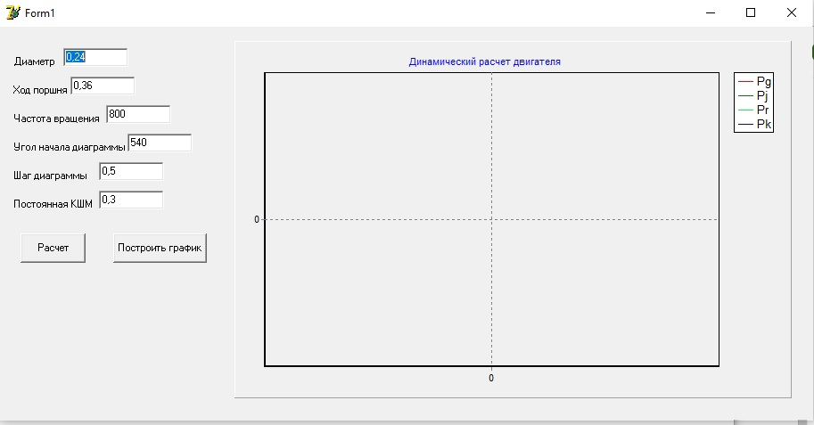
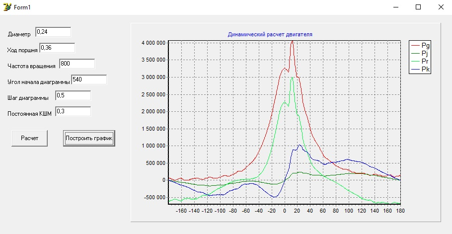

# Learning Simulation (Delphi) - Dynamics of the engine crank mechanism

Demo

 

Info
The program is designed to calculate the dynamics of the engine crank mechanism

1. Reads pressure values from file Pg.txt 
2. The initial data for plotting is written to the file res.txt
3. The "Step of the diagram (Шаг диаграммы)" depends on the pressure values given in the file Pg.txt
4. After the calculation, a graph can be displayed - by pressing the button "Build Graph (Построить график)"  